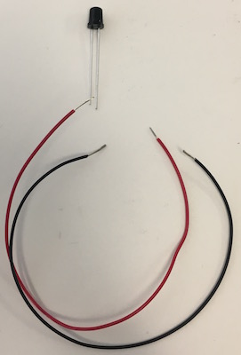
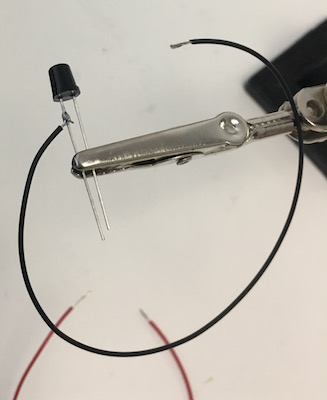
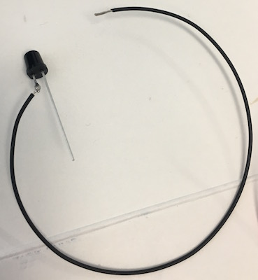
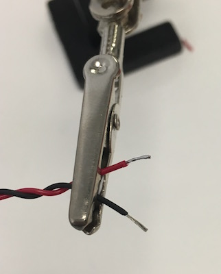
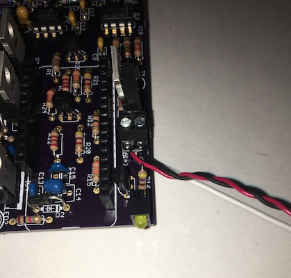
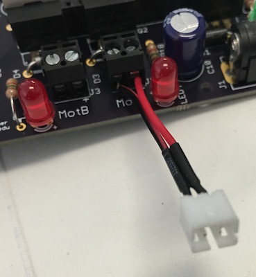
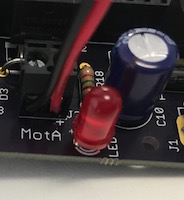
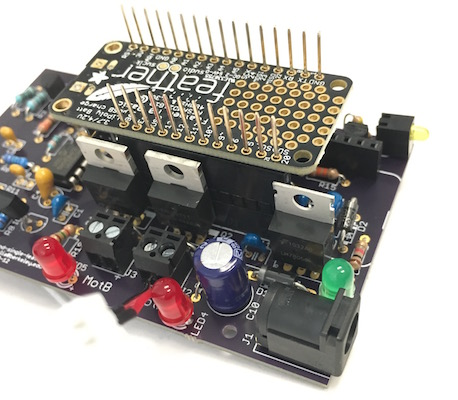
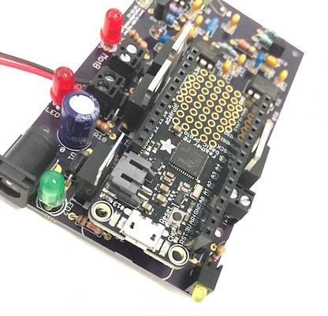
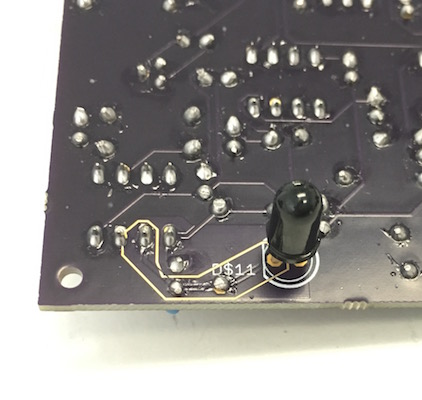

## Controller Electronics

### Ordering Information

The printed circuit board design files can be found in `design/circuit/`. The `band-single-feather.brd` file can be uploaded directly to printed circuit board fabricators such as [Oshpark](https://oshpark.com). Order it as a two-layer board, with a 63 mil (1.6 mm) thickness FR4 board with 1 oz copper.

The  list of components needed for circuit board assembly can be found in `design/circuit/` as well. The `band-single-feather-bom.csv` file is a list of each component with ordering information. The `band-single-feather-bom-order.txt` file is a simplified list of component quantities and part numbers that can be uploaded directly.

#### Equipment

* Soldering iron

* Heat gun

* Wire cutters

* Wire strippers

* Small screwdrivers

#### Consumables

* Solder

* Hookup wire -- red and black -- 22 - 26 AWG stranded

* Heat shrink tubing

### Assembly

The controller electronics can be assembled entirely by through-hole soldering. Most components can be assembled with no special considerations. Exceptions are noted below, and should be handled in the order described.

1. **Nephelometer LED** The SFH 4547 IR LED (Osram) is connected to the controller by hookup wire on screw terminals.

   1. Cut matched ~15cm lengths of red and black hookup wire and strip both ends.
   
   
   
   2. Wrap the black wire around the cathode lead (longer with a flat region on the package) just at the thick point of the lead.

   

   3. Solder the wire to the lead and trim away the remaining lead along with any excess wire.

   

   

   4. Wrap the red wire around the anode lead, solder it, and trim.

   

   5. Slide 1cm pieces of heat shrink tubing along each wire up past the solder joints to the base of the package

   

   6. Shrink the tubing with a heat gun, using a piece of cardboard (or something else) to shield the case itself.

   

   7. For stranded hookup wire, twist and tin the other ends

   

   8. Wind the wires around themselves

   9. Insert the wires into the screw terminal, taking care to put the red lead in the `+`.

   

   10.	 Screw down the connectors firmly onto the wires.

2. **Peristaltic pump connector** A short cable with a female JST PH 2-pin connector is attached to the screw terminal. This 2-pin connector can be cut from a JST PH extension cable, as described in the [Peristaltic Pump](./construction-pump.md) section. A short female cable can be purchased as well (Adafruit 261).

   1. Strip and tin the ends of the cable, if they are not already stripped and tinned.
   
   1. Insert the wires into the screw terminal, placing the red wire on the positive side marked with a "+"
   
   

   

3. **Feather microcontroller board** We prefer to use "stacking" header (Adafruit 2830) on the Feather board itself. The header must be installed with the correct alignment in order to fit into the headers on the controller electronics. 

   1. Use the Arduino software to load the controller software onto the Feather M0.
   
      The Feather should not be connected to the controller board and powered on before loading the software onto the microcontroller. Inappropriate configuration of certain microcontroller pins as "output" pins when the Feather is attached to the detector board could damage the microcontroller. The software ensures that pins are configured correctly for the detector board.

      1. Plug a micro-USB cable into the Feather
      1. Place the Feather on a non-conductive surface
      1. Plug the USB cable into a computer with the Arduino software and the Adafruit Feather board definitions installed
      1. Open the "firmware" Arduino project.
      1. From the "Tools" menu, use the "Board" submenu to select "Adafruit Feather M0".
      1. From the "Tools" menu, use the "Port" submenu to select the USB port connected to the Feather M0.
      1. From the "Sketch" menu, select "Upload". The Arduino IDE will compile the firmware and upload it onto the Feather
      1. Remove the micro-USB cable from the Feather

   1. Put ordinary male header into the female side of the stacking headers
   
   

   
   
   1. Insert the pins of that male header into the controller PCB itself, or another Feather board, on order to maintain proper alignment. 

   

   1. Place the Feather board over the pins of the stacking header, with the long pins protruding from the bottom. 

   

   1. Ensure that the boards and the headers are square, and then solder one pin on each header in place in order to stabilize the headers. 

   1. Solder the remaining pins of the header onto the bottom of the Feather board.

   

   1. Insert the male pins on the Feather header into the female sockets on the printed circuit board.

   

   

4. **Headers for Feather microcontroller board** Place the headers on the bottom pins of the Feather board. Mount the header onto the controller board and solder it in place. Remove the Feather from the controller board.

5. **Nephelometer photodiode** The design depends on the sensitivity and physical package of the BPV10NF (Vishay) photodiode and so the use of this specific part is important. The photodiode is mounted on the opposite side of the circuit board relative to all other components. Insert the diode through the holes in the correct orientation until the wider parts of the lead bind against the holes in the circuit board. Solder the photodiode in place from the "top" side of the circuit board with the circuit board level and the photodiode hanging vertically down from the bottom, with the leads fully inserted.

### Testing

1. Connecting to the Feather
   1. Plug a micro-USB cable into the Feather installed on the detector board
   1. Plug the USB cable into a computer
   1. Connect to the Feather with a serial terminal program
   1. Typing `h` in the serial window should provide a list of all commands
1. Testing the optical turbidity measurement
   1. Type `m` into the serial window in order to begin periodic measurements
   1. Block light from the LED from reaching the photodiode and ensure that the system reports a small, positive value, typically 0.1 - 0.5
   1. Point the LED and the photodiode at a piece of paper in order to produce a strong reflected light signal and ensure that the system saturates at a measurement of roughly 40.
1. Testing the pumps
   1. Plug in the 12VDC power converter to the controller board and the wall outlet.
   1. Type `p` into the serial window in order to manually activate a pump
   1. Select pump `A`
   1. Type `5` followed by *Enter* to request 5 seconds of pumping
   1. The red LED for pump A should light up for five seconds.
   1. Repeat this procedure to activate pump B.
