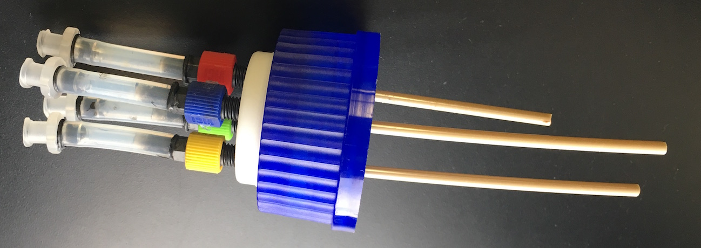
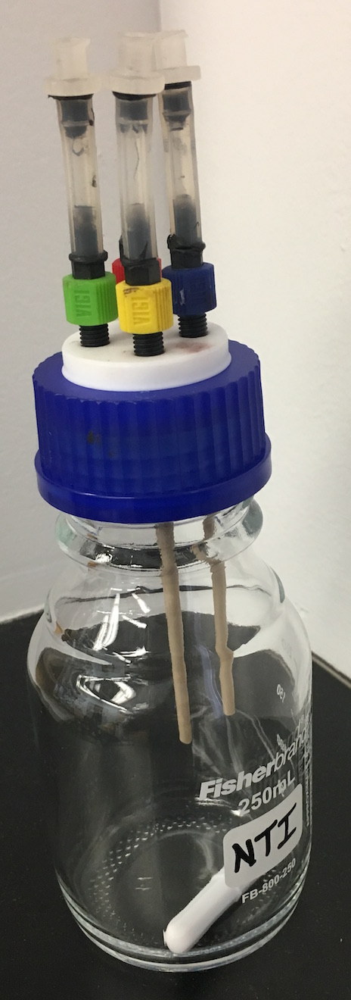

## Fluidics

### Part information
* 5-liter glass bottle with GL45 cap: Fisher Scientific FB8005000
* 2-liter glass bottle with GL45 cap: Fisher Scientific FB8002000
* 250-ml glass bottle with GL45 cap: Fisher Scientific FB800250
* 3-port GL45 bottle cap with PPS nuts: VICI Precision Sampling JR-S-11002
* 4-port GL45 bottle cap with PPS nuts: VICI Precision Sampling JR-S-11003
* 1/4"-28 PPS nut for 1/8" tubing: VICI Precision Sampling JR-55051-10
* ID 0.125in barb to 1/4"-28 UNF, polypropylene: Cole-Parmer EW-31501-54
* Inverted EFTE ferrules for 0.125in OD tubing: VICI Precision Sampling JR-051-10
* Male Luer to ID 0.125in barb, polypropylene: Value Plastics MTLL013-6005
* Female Luer to ID 0.125in barb, polypropylene: Value Plastics FTLL013-6005
* Male Luer plug, polypropylene: Value Plastics MTLLP-6005
* Female Luer plug, polypropylene: FTLLP-6005
* Barbed Y-connector, ID 0.125in tubing, polypropylene: Cole-Parmer EW-40726-43
* 250 ml Filtering Flask with Quick-Release Connector: Kimble Chase 27070-250
* #6 rubber stopper
* PEEK tubing, ID 0.062in / OD 0.125in: McMaster Carr 51085K49; Idex Health Science 1544
* Plastic tubing cutter: Idex Health Science A-327
* Silicone tubing, ID 0.125in / OD 0.250in, 50 feet: Thermo 8060-0030
* ID 1.0mm tube clips: Boxer 9000.601
* Straight reducing connector, 2.0mm to 1.0mm, barbed: Boxer 3924
* Silicone tubing ID 1.0mm / OD 3.0mm, 1 meter: Boxer 9000.507
* ID 3.0mm tube clips: Boxer 9000.603
* Silicone tubing ID 3.0mm / OD 5.0mm, 1 meter: Boxer 9000.508
* PTFE tubing ID 0.085in / OD 0.125in, 5 meter: Vici Valco TTF285-5M
* Whisper 20 aquarium pump: VWR 470100-740
* RTV Silicone sealant: Permatex 82180

* ZZZ magnetic stir plate
* ZZZ magnetic stir bar

### Media Reservoir
* **Media Reservoir Bottle** glass bottle (2l or 5l) with GL45 cap
* **Media Reservoir Cap** GL45 bottle cap with 3 connectors:
  * **Media fill** has 5cm silicone tubing with a female Luer. It connects to the sterile output of a Sterivex filter.
  
    Screw an ID 0.125in barb to 1/4"-28 UNF fitting into the bottle cap port. Attach a 5cm piece of silicone tubing and insert a female Luer to ID 0.125in barb in the other end.

  * **Vent** has 5cm silicone tubing with a female Luer. It connects to a syringe-style disk filter to provide sterile vent air.
  
    Screw an ID 0.125in barb to 1/4"-28 UNF fitting into the bottle cap port. Attach a 5cm piece of silicone tubing and insert a female Luer to ID 0.125in barb in the other end.
      
  * **Media delivery** has 40cm of PTFE tubing below the cap, and 5cm silicone tubing with a female Luer. It withdraws media, under suction, from the reservoir.
  
    Insert PTFE tubing OD 0.125in through the bottom of a bottle cap port. Slip an inverted EFTE ferrule on the end protruding above the cap. Screw an 0.125in barb to 1/4"-28 UNF fitting onto the port, tightening it firmly. The PTFE tubing should be held in place by the ferrule. Slip a ~5 cm length of ID 0.125in silicone tubing around the far end in order to weight it down, keeping it at the bottom of the bottle.
  

  
  
* **Filtration pump line** is a peristaltic pump line with ID 3.0mm tubing. It delivers media to the Sterivex filter.

  * Insert a female Luer to ID 0.125in barb into each end of a 20 cm piece of ID 3.0mm silicone peristaltic pump tubing.
  * Insert a male Luer to ID 0.125in barb into each end of a 50 cm piece of ID 0.125in silicone tubing.
  * Insert a male Luer to ID 0.125in barb into each end of a 100 cm piece of ID 0.125in silicone tubing.
  * Connect the 50 cm and the 100 cm pieces of silicone tubing to each end of the peristaltic pump tubing, using the Luer fittings.

* **Media delivery manifold** is a "Y" splitter for media delivery. One delivery manifold is needed for each turbidostat, after the first, that will be fed from a single media reservoir.
  
  Place 2cm pieces of ID 0.125in silicone tubing on each of the three fittings of a barbed Y-connector. Insert a male Luer to 0.125in barb into the tubing at the base of the "Y", and a female Luer to 0.125in barb into the pieces of tubing at each end of the "Y".
    
### Growth Chamber
* **Growth Chamber Bottle** glass 250ml bottle with GL45 cap
* **Growth Chamber Cap** GL45 bottle cap with 4 connectors, each with 2.5cm silicone tubing and a female Luer extending above the cap. 

  Three ports hold rigid 1/8" PEEK tubing that passes through the cap and the PPS nut. The fourth 1/16" port cannot pass the PEEK tubing, and so it is used for media, which drips directly from the port in the cap.
  
  Cut PEEK tubing to extend 1cm above the top of the PPS nut and extend 70mm (for waste) or 95mm (for air and inoculation) below the bottom of the nut. Cut a 2.5cm piece of ID 0.125in silicone tubing. Place the appropriate colored sleeve onto the PPS nut. Thread the PEEK tubing through the PPS nut and apply a small amount of RTV silicone sealant around the top of the PPS nut where the PEEK tubing emerges. Slide the silicone tubing over the top of the PEEK tubing. Twist the tubing around and slide it up and down slightly in order to coat the junction thoroughly with silicone. Apply a small amount of silicone sealant to the base of an ID 0.125in barb to female Luer adapter and insert it into the other end of the silicone tubing, twisting it around to spread the sealant across the junction. Allow the assembly to dry undisturbed for 24 hours and then screw the PPS nut into the cap.

  

  * **Air** *(yellow)* trim to 86 mm beneath the bottom of the cap
  
  * **Inoculation** *(blue)* trim to 86 mm beneath the bottom of the cap
  
  * **Waste** *(red)* trim to 62 mm beneath the bottom of the cap
  
  * **Media** *(green)* attach to the 1/16" port on the cap 
  
  
  

* **Media Pump Line** Thin, ID 1.0mm peristaltic pump tubing that delivers media to the growth chamber.

  The longer section of silicone tubing will extend from the media pump (near the growth chamber) to the media reservoir. Select a tubing length suitable for the placement of the growth chamber and media reservoir.

  * Insert a female Luer to ID 0.125in barb into each end of a 20 cm piece of ID 1.0mm silicone peristaltic pump tubing.
  * Insert a male Luer to ID 0.125in barb into each end of a 25 cm piece of ID 0.125in silicone tubing.
  * Insert a male Luer to ID 0.125in barb into each end of a 50 - 100 cm piece of ID 0.125in silicone tubing.
  * Connect the 25 cm and the 50 - 100 cm pieces of silicone tubing to each end of the peristaltic pump tubing, using the Luer fittings.

* **Waste Line** Silicone tubing with barbed male Luer connectors

  Select a tubing length suitable for the placement of the growth chamber and the waste.

  Insert ID 0.125 barb to male Luer fittings into each end of a 50 - 100 cm piece of ID 0.125 in silicone tubing

### Humidifier
* **Humidifier Flask** 250 ml filtering flask
  
  Unscrew the quick-release connector and remove the plastic barbed adapter. Insert a 40cm piece of ID 0.125in silicone tubing through the connector and screw it back on to the side of the flask. Insert a ID 0.125in barb to male Luer connector into the other end of the silicone tubing.
  
* **Humidifier Stopper** #6 rubber stopper

  Pierce a 1/8" hole through the rubber stopper. Thread a piece of PEEK tubing through the bottom of the hole until it extends 1cm above the top of the stopper. Cut the PEEK tubing so it will extend near the bottom of the filtering flask when the stopper is inserted. Cut a 2.5cm piece of ID 0125in silicone tubing. Apply a small amount of RTV silicone sealant around the PEEK tubing where it emerges from the top of the stopper and then slide the silicone tubing over the PEEK tubing and twist it to spread the silicone sealant thoroughly across the junction. Apply a small amount of silicone sealant to the base of an ID 0.125in barb to male Luer adapter and insert it into the other end of the silicone tubing, twisting it around to spread the sealant across the junction. Allow the assembly to dry undisturbed for 24 hours.

