## Controller Electronics

### Ordering Information

### Assembly

The controller electronics can be assembled entirely by through-hole soldering. Most components can be assembled with no special considerations. Exceptions are noted below, and should be handled in the order described.

1. **Nephelometer LED** The SFH 4547 IR LED (Osram) is connected to the controller by hookup wire on screw terminals.

   1. Cut matched ~15cm lengths of red and black hookup wire and strip both ends.
   
   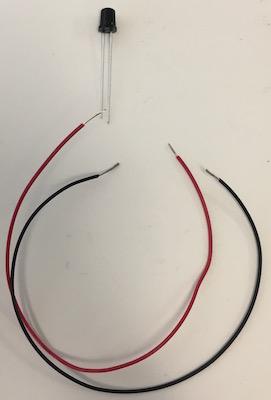
   
   2. Wrap the black wire around the cathode lead (longer with a flat region on the package) just at the thick point of the lead.

   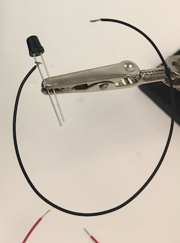

   3. Solder the wire to the lead and trim away the remaining lead along with any excess wire.

   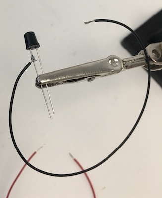

   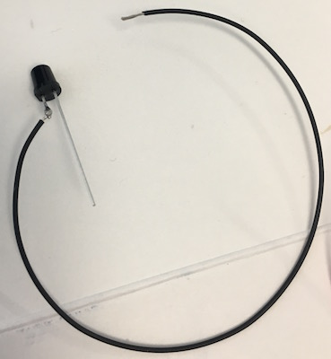

   4. Wrap the red wire around the anode lead, solder it, and trim.

   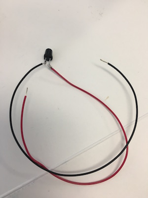

   5. Slide 1cm pieces of heat shrink tubing along each wire up past the solder joints to the base of the package

   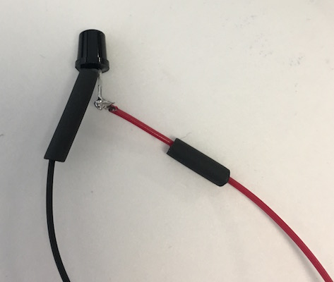

   6. Shrink the tubing with a heat gun, using a piece of cardboard (or something else) to shield the case itself.

   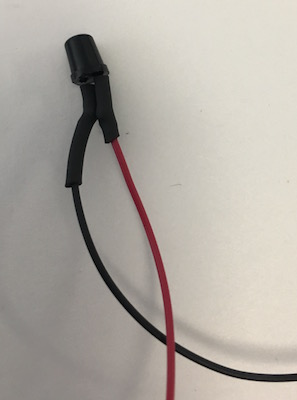

   7. For stranded hookup wire, twist and tin the other ends

   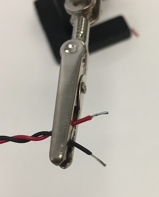

   8. Wind the wires around themselves

   9. Insert the wires into the screw terminal, taking care to put the red lead in the `+`.

   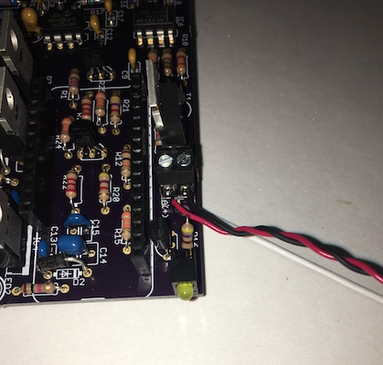

   10.	 Screw down the connectors firmly onto the wires.

2. **Peristaltic pump connector** A short cable with a female JST PH 2-pin connector is attached to the screw terminal. See the "Peristaltic Pump" section, below, for more details.

3. **Feather microcontroller board** We prefer to use "stacking" header (Adafruit 2830) on the Feather board itself. The header must be installed with the correct alignment in order to fit into the headers on the controller electronics. 

   1. Use the Arduino software to load the controller software onto the Feather M0.
   
      The Feather should not be connected to the controller board and powered on before loading the software onto the microcontroller. Inappropriate configuration of certain microcontroller pins as "output" pins when the Feather is attached to the detector board could damage the microcontroller. The software ensures that pins are configured correctly for the detector board.

      1. Plug a micro-USB cable into the Feather
      1. Place the Feather on a non-conductive surface
      1. Plug the USB cable into a computer with the Arduino software and the Adafruit Feather board definitions installed
      1. Open the "firmware" Arduino project.
      1. From the "Tools" menu, use the "Board" submenu to select "Adafruit Feather M0".
      1. From the "Tools" menu, use the "Port" submenu to select the USB port connected to the Feather M0.
      1. From the "Sketch" menu, select "Upload". The Arduino IDE will compile the firmware and upload it onto the Feather
      1. Remove the micro-USB cable from the Feather

   1. Put ordinary male header into the female side of the stacking headers
   
   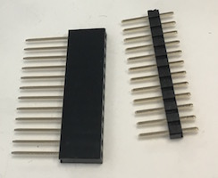

   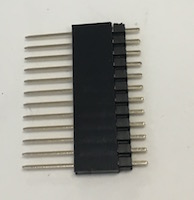
   
   1. Insert the pins of that male header into the controller PCB itself, or another Feather board, on order to maintain proper alignment. 

   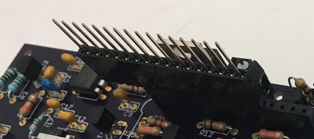

   1. Place the Feather board over the pins of the stacking header, with the long pins protruding from the bottom. 

   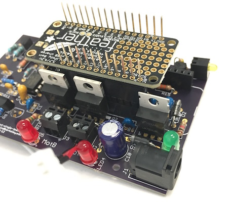

   1. Ensure that the boards and the headers are square, and then solder one pin on each header in place in order to stabilize the headers. 

   1. Solder the remaining pins of the header onto the bottom of the Feather board.

   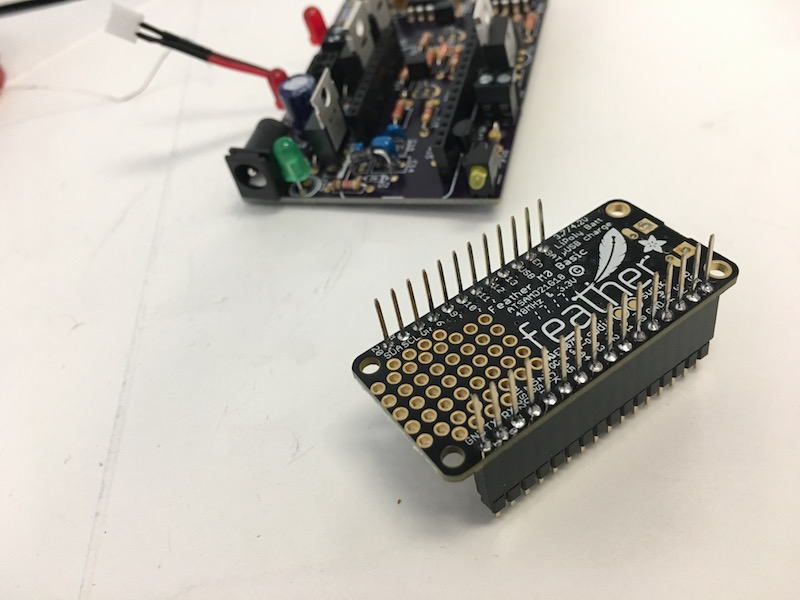

   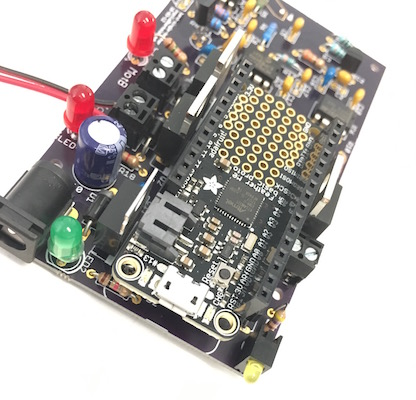

   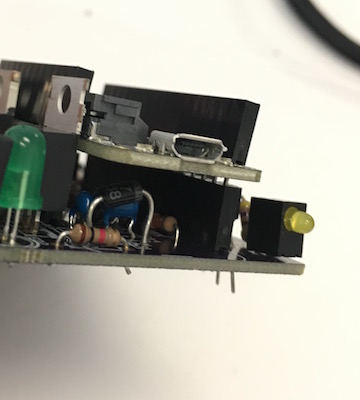

4. **Headers for Feather microcontroller board** Place the headers on the bottom pins of the Feather board. Mount the header onto the controller board and solder it in place. Remove the Feather from the controller board.

5. **Nephelometer photodiode** The design depends on the sensitivity and physical package of the BPV10NF (Vishay) photodiode and so the use of this specific part is important. The photodiode is mounted on the opposite side of the circuit board relative to all other components. Insert the diode through the holes in the correct orientation until the wider parts of the lead bind against the holes in the circuit board. Solder the photodiode in place from the "top" side of the circuit board with the circuit board level and the photodiode hanging vertically down from the bottom, with the leads fully inserted.

### Testing

1. Connecting to the Feather
   1. Plug a micro-USB cable into the Feather installed on the detector board
   1. Plug the USB cable into a computer
   1. Connect to the Feather with a serial terminal program
   1. Typing `h` in the serial window should provide a list of all commands
1. Testing the optical turbidity measurement
   1. Type `m` into the serial window in order to begin periodic measurements
   1. Block light from the LED from reaching the photodiode and ensure that the system reports a small, positive value, typically 0.1 - 0.5
   1. Point the LED and the photodiode at a piece of paper in order to produce a strong reflected light signal and ensure that the system saturates at a measurement of roughly 40.
1. Testing the pumps
   1. Plug in the 12VDC power converter to the controller board and the wall outlet.
   1. Type `p` into the serial window in order to manually activate a pump
   1. Select pump `A`
   1. Type `5` followed by *Enter* to request 5 seconds of pumping
   1. The red LED for pump A should light up for five seconds.
   1. Repeat this procedure to activate pump B.

## Controller Housing

### Part information
* Krylon Ultra-flat Black 1602 spray paint

  This ultra-flat black spray-paint is highly absorbing in the near-infrared wavelength used to measure turbidity. Many other visually black materials reflect near-IR light.

* M2 x 8mm pan head phillips screw, 316 stainless: McMaster-Carr 90116A015
* M2 hex nut, 316 stainless: McMaster-Carr 94150A305	

### Assembly

The controller housing is printed as two separate components, a "band" that wraps around the growth chamber and a "box" that houses the detector circuit board. 

1. Remove any support material from the printed parts.
1. Spray paint the band and the box flat black, paying particular attention to the holes for the LED and the photodiode. Dry overnight.

1. Fit the band against the box. 

   * The square protrusion from the band should align with the square hole on the box. 
   * The two flat arms extending from the band with screw holes should align with screw holes on the box.
   
1. Insert M2 x 8mm screws through the holes in the band into the box.
1. Thread M2 hex nuts onto the screws and tighten.
1. Insert the detector circuit board into the box, with the photodiode on the bottom passing through the square opening on the box and into the round hole in the band.
1. Align the mounting holes on the detector circuit board with the mounting holes on the box.
1. Insert M2 x 8mm screws through at least two mounting holes on the circuit board, passing through the box to protrude on the outside.
1. Thread M2 hex nuts onto the screws outside the box and tighten. 

## Peristaltic Pump

### Part information
* Peristaltic pump: 
  * Boxer 9K 12VDC 315 rpm 3 roller, Boxer 9022.000
    
    We have used exclusively this pump in our work.
    
  * Boxer 9QQ 12VDC 315 rpm 3 roller, Boxer 9022.930
  
    This pump is recommended as a replacement for the 9K in new designs. The tubing and mounting appear physically compatible with the 9K. The pumping rate is slightly faster: 55 µl per revolution as opposed to 48 µl per revolution with the Boxer 9K, and the same angular speed.

* Two-circuit screw-connector barrier strip: Molex Eurostyle 39100-1902, Digi-Key WM12408-ND
* M2 x 12mm pan head phillips screw, 316 stainless: McMaster-Carr 90116A022
* M2 hex nut, 316 stainless: McMaster-Carr 94150A305 
* M3 x 12mm pan head phillips screw, 316 stainless: McMaster-Carr 90116A157	
* M3 hex nut, 316 stainless: McMaster-Carr 94150A325	

### Assembly

The peristaltic pump is mounted on a 3-D printed housing and wired to a barrier strip on the same housing, which is connected to a 2-conductor JST cable.

1. Flip the cover latch up until you can pull the cover off of the pump
1. Insert the pump motor body into the large hole on the pump stand
1. Align the mounting holes on the pump face with the mounting holes on the stand.
1. Insert M3 x 12mm screws into the holes
1. Thread M3 hex nuts onto the other ends of the screws and tighten
1. Align the hole in the center of the barrier strip with a hole on the side of the pump stand.
1. Thread an M2 screw through the aligned holes. Attach an M2 hex nut on the other end and tighten.
1. Cut matched 5cm pieces of red and black hookup wire. Strip a short length on each end.
1. Thread one end of the red wire through the solder tab marked with a small `+`, twist it around, and solder it.
1. Solder the black wire onto the other solder tab in the same way.
1. Cut two short (~1 cm) pieces of heat shrink tubing 

## Fluidics

### Part information
* 5-liter glass bottle with GL45 cap: Fisher Scientific FB8005000
* 2-liter glass bottle with GL45 cap: Fisher Scientific FB8002000
* 250-ml glass bottle with GL45 cap: Fisher Scientific FB800250
* 3-port GL45 bottle cap with PPS nuts: VICI Precision Sampling JR-S-11002
* 4-port GL45 bottle cap with PPS nuts: VICI Precision Sampling JR-S-11003
* 1/4"-28 PPS nut for 1/8" tubing: VICI Precision Sampling JR-55051-10
* ID 0.125in barb to 1/4"-28 UNF, polypropylene: Cole-Parmer EW-31501-54
* Inverted EFTE ferrules for 0.125in OD tubing: VICI Precision Sampling JR-051-10
* Male Luer to ID 0.125in barb, polypropylene: Value Plastics MTLL013-6005
* Female Luer to ID 0.125in barb, polypropylene: Value Plastics FTLL013-6005
* Male Luer plug, polypropylene: Value Plastics MTLLP-6005
* Female Luer plug, polypropylene: FTLLP-6005
* Barbed Y-connector, ID 0.125in tubing, polypropylene: Cole-Parmer EW-40726-43
* 250 ml Filtering Flask with Quick-Release Connector: Kimble Chase 27070-250
* #6 rubber stopper
* PEEK tubing, ID 0.062in / OD 0.125in: McMaster Carr 51085K49; Idex Health Science 1544
* Plastic tubing cutter: Idex Health Science A-327
* Silicone tubing, ID 0.125in / OD 0.250in, 50 feet: Thermo 8060-0030
* ID 1.0mm tube clips: Boxer 9000.601
* Straight reducing connector, 2.0mm to 1.0mm, barbed: Boxer 3924
* Silicone tubing ID 1.0mm / OD 3.0mm, 1 meter: Boxer 9000.507
* ID 3.0mm tube clips: Boxer 9000.603
* Silicone tubing ID 3.0mm / OD 5.0mm, 1 meter: Boxer 9000.508
* PTFE tubing ID 0.085in / OD 0.125in, 5 meter: Vici Valco TTF285-5M
* Whisper 20 aquarium pump: VWR 470100-740
* RTV Silicone sealant: Permatex 82180

* ZZZ magnetic stir plate
* ZZZ magnetic stir bar

### Media Reservoir
* **Media Reservoir Bottle** glass bottle (2l or 5l) with GL45 cap
* **Media Reservoir Cap** GL45 bottle cap with 3 connectors:
  * **Media fill** has 5cm silicone tubing with a female Luer. It connects to the sterile output of a Sterivex filter.
  
    Screw an ID 0.125in barb to 1/4"-28 UNF fitting into the bottle cap port. Attach a 5cm piece of silicone tubing and insert a female Luer to ID 0.125in barb in the other end.

  * **Vent** has 5cm silicone tubing with a female Luer. It connects to a syringe-style disk filter to provide sterile vent air.
  
    Screw an ID 0.125in barb to 1/4"-28 UNF fitting into the bottle cap port. Attach a 5cm piece of silicone tubing and insert a female Luer to ID 0.125in barb in the other end.
      
  * **Media delivery** has 40cm of PTFE tubing below the cap, and 5cm silicone tubing with a female Luer. It withdraws media, under suction, from the reservoir.
  
    Insert PTFE tubing OD 0.125in through the bottom of a bottle cap port. Slip an inverted EFTE ferrule on the end protruding above the cap. Screw an 0.125in barb to 1/4"-28 UNF fitting onto the port, tightening it firmly. The PTFE tubing should be held in place by the ferrule. Slip a ~5 cm length of ID 0.125in silicone tubing around the far end in order to weight it down, keeping it at the bottom of the bottle.
  
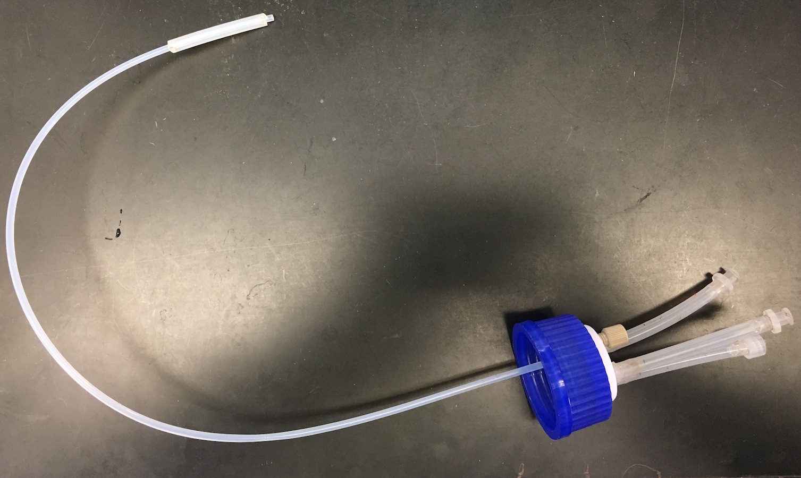
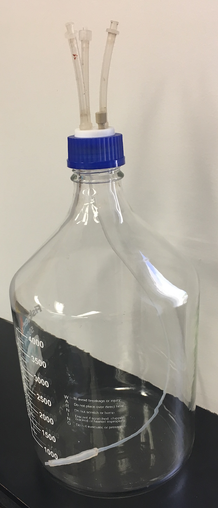  
  
* **Filtration pump line** is a peristaltic pump line with ID 3.0mm tubing. It delivers media to the Sterivex filter.

  * Insert a female Luer to ID 0.125in barb into each end of a 20 cm piece of ID 3.0mm silicone peristaltic pump tubing.
  * Insert a male Luer to ID 0.125in barb into each end of a 50 cm piece of ID 0.125in silicone tubing.
  * Insert a male Luer to ID 0.125in barb into each end of a 100 cm piece of ID 0.125in silicone tubing.
  * Connect the 50 cm and the 100 cm pieces of silicone tubing to each end of the peristaltic pump tubing, using the Luer fittings.

* **Media delivery manifold** is a "Y" splitter for media delivery. One delivery manifold is needed for each turbidostat, after the first, that will be fed from a single media reservoir.
  
  Place 2cm pieces of ID 0.125in silicone tubing on each of the three fittings of a barbed Y-connector. Insert a male Luer to 0.125in barb into the tubing at the base of the "Y", and a female Luer to 0.125in barb into the pieces of tubing at each end of the "Y".
    
### Growth Chamber
* **Growth Chamber Bottle** glass 250ml bottle with GL45 cap
* **Growth Chamber Cap** GL45 bottle cap with 4 connectors, each with 2.5cm silicone tubing and a female Luer extending above the cap. 

  Three ports hold rigid 1/8" PEEK tubing that passes through the cap and the PPS nut. The fourth 1/16" port cannot pass the PEEK tubing, and so it is used for media, which drips directly from the port in the cap.
  
  Cut PEEK tubing to extend 1cm above the top of the PPS nut and extend 70mm (for waste) or 95mm (for air and inoculation) below the bottom of the nut. Cut a 2.5cm piece of ID 0.125in silicone tubing. Place the appropriate colored sleeve onto the PPS nut. Thread the PEEK tubing through the PPS nut and apply a small amount of RTV silicone sealant around the top of the PPS nut where the PEEK tubing emerges. Slide the silicone tubing over the top of the PEEK tubing. Twist the tubing around and slide it up and down slightly in order to coat the junction thoroughly with silicone. Apply a small amount of silicone sealant to the base of an ID 0.125in barb to female Luer adapter and insert it into the other end of the silicone tubing, twisting it around to spread the sealant across the junction. Allow the assembly to dry undisturbed for 24 hours and then screw the PPS nut into the cap.

  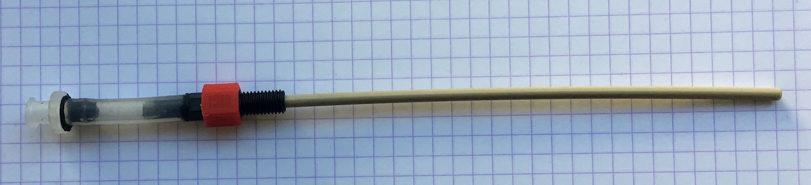

  * **Air** *(yellow)* trim to 86 mm beneath the bottom of the cap
  
  * **Inoculation** *(blue)* trim to 86 mm beneath the bottom of the cap
  
  * **Waste** *(red)* trim to 62 mm beneath the bottom of the cap
  
  * **Media** *(green)* attach to the 1/16" port on the cap 
  
  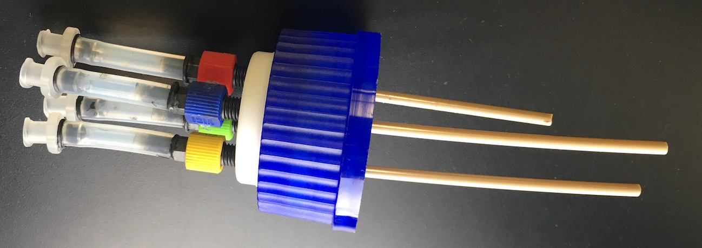
  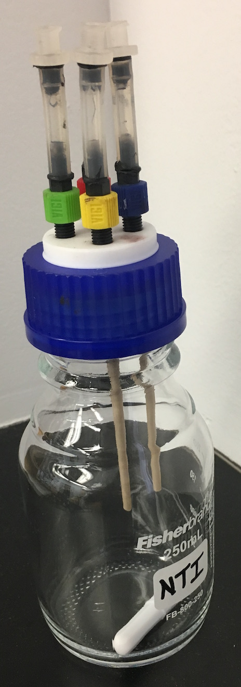

* **Media Pump Line** Thin, ID 1.0mm peristaltic pump tubing that delivers media to the growth chamber.

  The longer section of silicone tubing will extend from the media pump (near the growth chamber) to the media reservoir. Select a tubing length suitable for the placement of the growth chamber and media reservoir.

  * Insert a female Luer to ID 0.125in barb into each end of a 20 cm piece of ID 1.0mm silicone peristaltic pump tubing.
  * Insert a male Luer to ID 0.125in barb into each end of a 25 cm piece of ID 0.125in silicone tubing.
  * Insert a male Luer to ID 0.125in barb into each end of a 50 - 100 cm piece of ID 0.125in silicone tubing.
  * Connect the 25 cm and the 50 - 100 cm pieces of silicone tubing to each end of the peristaltic pump tubing, using the Luer fittings.

* **Waste Line** Silicone tubing with barbed male Luer connectors

  Select a tubing length suitable for the placement of the growth chamber and the waste.

  Insert ID 0.125 barb to male Luer fittings into each end of a 50 - 100 cm piece of ID 0.125 in silicone tubing

### Humidifier
* **Humidifier Flask** 250 ml filtering flask
  
  Unscrew the quick-release connector and remove the plastic barbed adapter. Insert a 40cm piece of ID 0.125in silicone tubing through the connector and screw it back on to the side of the flask. Insert a ID 0.125in barb to male Luer connector into the other end of the silicone tubing.
  
* **Humidifier Stopper** #6 rubber stopper

  Pierce a 1/8" hole through the rubber stopper. Thread a piece of PEEK tubing through the bottom of the hole until it extends 1cm above the top of the stopper. Cut the PEEK tubing so it will extend near the bottom of the filtering flask when the stopper is inserted. Cut a 2.5cm piece of ID 0125in silicone tubing. Apply a small amount of RTV silicone sealant around the PEEK tubing where it emerges from the top of the stopper and then slide the silicone tubing over the PEEK tubing and twist it to spread the silicone sealant thoroughly across the junction. Apply a small amount of silicone sealant to the base of an ID 0.125in barb to male Luer adapter and insert it into the other end of the silicone tubing, twisting it around to spread the sealant across the junction. Allow the assembly to dry undisturbed for 24 hours.

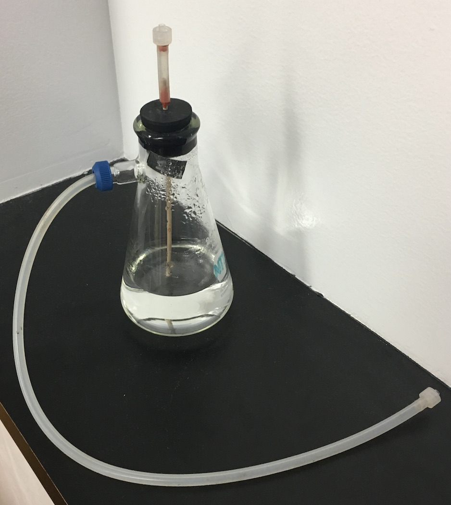