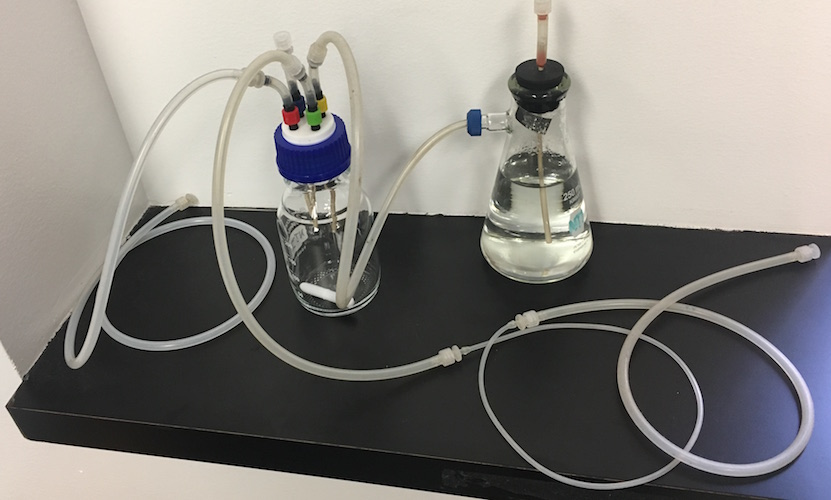

### Consumables

* Sterivex pressure-driven 0.22µm PES membrane filter, Luer: EMD Millipore SVGPL10RC
* Acrodisk 13mm Luer syringe filter, 0.22µm, PES:  Pall Laboratories 4602, VWR 28143-300
* 5 ml Luer syringe: BD Biosciences 309646, VWR BD309646

---
### Sterilizing the Media Reservoir

The media reservoir can be sterilized in advance.

1. If media delivery manifolds are needed, assemble these onto the media delivery connector.
1. Close the media fill and media delivery connectors with male Luer caps.
1. Close the vent connector with a female Luer cap.
1. Loosely fit the reservoir cap onto the reservoir bottle and ensure that the media delivery tubing within the bottle reaches the bottom
1. Place a large stir bar into the media bottle if needed
1. Autoclave to sterilize
1. Uncap the vent connector and attach a sterile Luer 13mm disc filter
1. Screw the cap tightly onto the bottle

---
### Filling the Media Reservoir

The media reservoir can be filled in advance of the experiment. The filled media reservoir can be placed in a warm room in order to equilibrate the media temperature.

The nominal capacity of the Sterivex filter is 2 liters but with "clean" media (little undissolved material) you can often add more, whereas with "dirty" media (lots of undissolved material) the filter will clog quickly.

1. Spray the capped media fill connector with 70% ethanol. Uncap the fill connector and attach a Sterivex pressure filter.
1. Attach the shorter side of the filtration pump line to the other end of the Sterivax pressure filter
1. Insert the peristaltic pump tubing into the media pump
  1. Flip the cover latch up until you can pull the cover off of the pump
  1. Remove the tubing restraints from the cover and put one clip on the tubing
  1. Place the clip with tubing in the cover and thread the tubing around the cover. The pump should turn clockwise. If you're facing the pump, media will move from the left side to the right side.
  1. Clip the tubing on the other side of the cover as well
  1. Slide the cover back onto the pump and flip the cover latch down
1. Place the other end of the filtration pump line into the media
1. Pump media through the Sterivex pressure filter into the reservoir
1. Detach the filtration pump line and leave the Sterivex filter uncapped. 

   We find that the uncapped Sterivex filter will dry out and maintain an aseptic barrier when left attached to the reservoir. You can also spray the media fill connector with 70% ethanol, remove the Sterivex filter, and recap the media fill connector with an autoclaved male Luer cap. We find that capping the inlet to the Sterivex filter allows microbial growth in the residual liquid trapped on the inlet side of the filter; while the filter will likely maintain an aseptic barrier under these conditions as well, we try to avoid this.
  
---
### Sterilizing the Growth Chamber
  
The growth chamber can be sterilized in advance of an experiment.  The sterilized growth chamber can be placed in a warm room in order to equilibrate the temperature prior to use. 
  
1. Fill the humidifier flask with >200 ml deionized water
1. Insert the stopper into the flask and close the air inlet with a female Luer cap
1. Place a stir bar into the growth chamber.
1. Loosely fit the growth chamber cap onto the growth chamber bottle
1. Connect the air outlet from the humidifer to the air (yellow) connector on the growth chamber cap.
1. Close the inoculation (blue) connector on the growth chamber cap with a male Luer cap.
1. Connect the waste line to the waste (red) connector on the growth chamber cap and close the other end of the waste line with a female Luer cap.
1. Connect the shorter end of the media pump line to the media (green) connector on the growth chamber cap. Close the other end of the media line with a female Luer cap.

   

1. Autoclave on liquid cycle to sterilize.
1. Uncap the air inlet connector on the humidifier and attach a sterile Luer 13mm disc filter
1. Screw the growth chamber cap tightly onto the growth chamber bottle

   As the system cools, air should be drawn in through the filter and bubble through the humidifer.

---
### Preparing the System

1. Fit the growth chamber into the band on the turbidostat controller, on top of the stir plate.
1. Connect the air pump to the syringe-style filter on the input to the air scrubber.

   Air should bubble into the humidifer and may continue to bubble slowly as the system is set up.

1. Snake the waste line through a conical tube holder (or similar) in order to create an "S" trap.
1. Uncap the waste line and put the end into a waste reservoir.

   The humidifer should bubble more vigorously once the waste line is uncapped. Occasionally, air flow through the humidifer will be blocked by wetting of the filter on the air inlet. If this happens, spray the air inlet connector on the humidifier with 70% ethanol, remove the wetted filter, and replace it with a fresh filter.
   
1. Insert the thin peristaltic pump tubing on the media line into the media pump.
   1. Flip the cover latch up until you can pull the cover off of the pump
   1. Remove the tubing restraints from the cover and put one clip on the tubing
   1. Place the clip with tubing in the cover and thread the tubing around the cover. The pump should turn clockwise. If you're facing the pump, media will move from the left side to the right side.
   1. Clip the tubing on the other side of the cover as well
   1. Slide the cover back onto the pump and flip the cover latch down
1. Connect the media line to the media reservoir.
   1. Spray the media line connector and the media delivery connector on the reservoir with 70% ethanol.
   1. Uncap the connectors and join them together.
1. Prime the media line by running the media pump.
	1. Use `p` to manually activate a pump
	1. Select the pump connected to the media pump line, e.g. `A`.
	1. Specify 100 seconds of pumping
	1. Watch flow of media through the feed line and stop the pump by hitting any key as soon as media starts to drip into the growth chamber. 
	
	   If the line was installed backwards in the peristaltic pump, air will bubble into the media reservoir; if this happens, simply reverse the pump tubing and re-prime the line. 

	```
	# band-dsp-feather manual [acghmpsz] > p
	# Which pump [A,B,C,D]: a
	# Enter pump duration (sec): 100
	# Planned pumping time: 100 sec (any key to interrupt)
	# Pumped 76.957 seconds
	# band-dsp-feather manual [acghmpsz] >
	```

1. Fill the growth chamber with media.

	1. Use `p` to manually activate a pump
	1. Select the pump connected to the media pump line, e.g. `A`.
	1. Specify 800 seconds of pumping
   
	```
	# band-dsp-feather manual [acghmpsz] > p
	# Which pump [A,B,C,D]: a
	# Enter pump duration (sec): 800
	# Planned pumping time: 800 sec (any key to interrupt)
	# Pumped 800.000 seconds
	# band-dsp-feather manual [acghmpsz] > 
	```
   
   _Note_ that pumping time can be used to compute media volume. The peristaltic pump runs at 315 revolutions per minute. With ID 1.0mm tubing, it delivers 48 µl / revolution, or 252 µl / second. At this pumping rate, 800 seconds of pumping delivers 202 ml of media.
   
1. Switch on the stir plate
1. Rotate the growth chamber within the controller band to ensure that the printing on the side of the bottle does not line up either with the LED or the photodetector.

---
### Inoculation

1. Begin turbidity measurements

   Use the `m` command in the controller software. The turbidity measurements should read a small value (typically between 0.1 and 0.5). Leave the measurement running during inoculation.
      
	```
	# band-dsp-feather manual [acghmpsz] > m
	M       time.s  neph    gain
	M       1972.2   0.526  5
	M       1972.7   0.709  5
	M       1973.2   0.725  5
	M       1973.7   0.735  5
	M       1974.2   0.620  5
	...
	```
   
1. Shut off the air input. Clamp the silicone tubing from the air pump to the humidifier, or detach the tubing entirely.

   Positive air pressure in the growth chamber will force media out of the inoculation connector when it is uncapped. Remove positive pressure before uncapping the inoculation connector.

1. Spray the closed inoculation connector with 70% ethanol
1. Uncap the inoculation connector
1. Remove a sterile Luer syringe from its wrapping. Pull out the plunger and return it to the wrapping, and attach the syringe barrel to the inoculation connector.
1. Transfer the inoculum into the barrel of the syringe using a pipette
1. Insert the plunger into the syringe barrel and push it down to deliver the inoculum. Pull the barrel up and down a few times to ensure that all of the inoculum is added to the media.
1. Restart the air input by unclamping or reattaching the tubing from the air pump.
1. Allow the inoculum to mix homogeneously throughout the growth chamber, which typically takes a minute or so.
1. Note the change in turbidity measurement and determine the relationship between cell density and turbidity.

	```
	...
	M       2034.0   0.422  5
	M       2034.5   0.412  5
	M       2035.0   0.544  5
	M       2035.5   0.613  5
	M       2036.0   0.703  5
	M       2036.5   0.651  5
	M       2037.0   0.501  5
	M       2037.5   0.510  5
	M       2038.0   0.622  5
	M       2038.5   0.623  5
	M       2039.0   0.456  5
	M       2039.5   3.053  5
	M       2040.0   1.644  5
	M       2040.5   1.715  5
	M       2041.0   6.748  5
	M       2041.5  12.634  5
	M       2042.0  10.852  5
	M       2042.5   9.702  5
	M       2043.0   8.681  5
	M       2043.5   6.704  5
	M       2044.0   6.003  5
	M       2044.5   6.259  5
	M       2045.0   6.042  5
	M       2045.5   5.910  5
	M       2046.0   5.975  5
	M       2046.5   5.817  5
	M       2047.0   5.727  5
	M       2047.5   5.336  5
	M       2048.0   5.289  5
	M       2048.5   4.882  5
	M       2049.0   5.545  5
	M       2049.5   6.430  5
	M       2050.0   6.302  5
	M       2050.5   6.421  5
	M       2051.0   6.523  5
	M       2051.5   6.359  5
	...
	M       2096.7   6.439  5
	M       2097.2   6.167  5
	M       2097.7   6.414  5
	M       2098.2   6.593  5
	M       2098.7   6.312  5
	M       2099.2   6.515  5
	M       2099.7   6.494  5
	M       2100.2   6.892  5	
	```

   In this example, the turbidity increased from ~0.5 to ~6.5 after inoculation.

   Using the cell density of the inoculum and the volume of media, compute the density of cells in the growth chamber. For example, if the above inoculation used 3.0e8 cells into 200 ml media, this would yield 1.5e6 cells / ml.
   
   In this example, a turbidity of 6.0 corresponds to 1.5e6 cells / ml, and 1.0 turbidity unit corresponds to 2.5e5 cells / ml.
      
---
### Turbidostatic Growth

1. Determine the target culture turbidity.

   The cell density to turbidity ratio computed during inoculation may be useful here. For example, if 1 turbidity unit corresponds to 2.5e5 cells / ml, then a target cell density of 2.5e6 cells / ml would correspond to a turbidity measurement of 10.0.
   
1. Set up the turbidostat controller. Use the `s` command to _set up_ a controller, and then select the _Turbidostat_ controller with `t`.

1. Enter the parameters to configure the turbidostat.

   1. The "Target neph" parameter is the target turbidity (nephelometry)
   
   1. The media pump determines which pump will be activated when the turbidity rises above the set point.
   
1. Start the  turbidostat controller. Use the `c` command to start the configured controller.

1. The running turbidostat will measure cell density and report data every second.

   1. Data lines from the turbidostat controller will begin with `T` so they can be extracted from log files easily.
   
   1. The `time.s` column reports on the time (in seconds) since the controller was started.
   
   1. The `neph` column reports on the turbidity (nephelometry) measurement
   
   1. The `gain` column reports on the gain setting for the turbidity measurement
   
      _Note_ that the gain factor is not divided out of the `neph` data. For example, a `neph` value of 3.0 with a `gain` factor of 2 is equivalent to a `neph` value of 7.5 with a `gain` factor of 5.
   
   1. The `target` column reports on the target turbidity setting.
   
   1. The `pumpon` column is _1_ when the pump was active during the preceding second and _0_ when the pump was not active.
   
   1. The `pumptime.s` column reports on the cumulative pumping time, in seconds.

		```
		# band-dsp-feather manual [acghmpsz] > s
		# Pick a controller to configure
		# CONFIGURED CONTROLLER: NONE
		# CONTROLLERS:
		#   m                                             Manual
		#   t                                        Turbidostat
		#   r                                  Turbidostat Ratio
		#   i                                 Turbidostat Induce
		#   c                        Turbidostat Cycle Time Conc
		#   g                     Turbidostat Gradient Time Conc
		#   l                 Turbidostat Log-Gradient Time Conc
		#   d                       Turbidostat Density Gradient
		# Pick a controller: t=Turbidostat
		# Current settings:
		# Target neph 40.951
		# Pump A
		# Hit return to leave a parameter unchanged
		# Enter target neph measurement(40.951): 10
		# Enter media pump (A): *
		# (not updated)
		# Current settings:
		# Target neph 10.000
		# Pump A
		# band-dsp-feather manual [acghmpsz] > c
		T	time.s	neph	gain	target	pumpon	pumptime.s
		T	0	6.758	5	10.000	0	15.000
		T	0	6.941	5	10.000	0	15.000
		T	1	6.958	5	10.000	0	15.000
		T	2	7.214	5	10.000	0	15.000
		T	3	7.075	5	10.000	0	15.000
		T	4	6.962	5	10.000	0	15.000
		T	5	7.109	5	10.000	0	15.000
		```

---
### Replenishing the Media Reservoir

The reservoir can be refilled during operation by attaching a new filter aseptically and pumping in new media while the system is operating.

1. Spray the media fill connector (with either a cap or a used filter attached) with 70% ethanol.
1. Detach the media fill connector and attach the outlet of a new Sterivex filter.
1. Pump media through the Sterivex filter as described above.

---
### Changing Media Sources

The media pump line can be switched to a new media source in order to change media during operation. If multiple growth chambers are fed from a single media reservoir using a media delivery manifold, then the entire manifold can be switched as a single unit.

1. Spray both the capped media delivery connector on the new reservoir and the connection between the media pump line and the old reservoir with 70% ethanol.
1. Uncap the media delivery connector on the new reservoir.
1. Detach the media pump line from the old reservoir and attach it to the media delivery connector on the new reservoir.	

---
### Disassembly

The main goal is to avoid making a mess while disconnecting the turbidostat. 

1. Disconnect the tubing between the air pump and the humidifier by detaching it from the disc filter.

   This removes positive pressure from the system.
   
1. Detach the Luer connection between the air line and the growth chamber cap.
1. Stop the turbidostat controller by hitting `q` in the controller software.
1. Detach the Luer connection between the waste line and the growth chamber cap. Drain any residual waste collected in the "S-trap" out of the line.
1. Detach the Luer connection between the media pump line and the media reservoir. Cap the media pump line with a female Luer cap.

   Note that media generally will not drain from the media pump line while the tubing is still engaged by the peristaltic pump. If the media pump line is removed from the pump, however, then media will siphon out of the pump line when it is disconnected. To avoid this, detach and cap both ends of the media pump line before removing it from the peristaltic pump.

1. Detach the Luer connection between the media pump line and the growth chamber cap. Cap this end of the media pump line with a female Luer cap as well.
1. Remove the media pump line from the peristaltic pump.
   1. Flip the cover latch up until you can pull the cover off of the pump
   1. Remove the tubing restraints from the cover and pull the peristaltic pump tubing out of the restraints.
   1. Return the restraints to the cover. The tubing restraints are small and easily misplaced.
   1. Return the cover onto the pump.
1. Lift the growth chamber carefully out of the plastic band of the detector.
1. To compute more accurate absolute growth rate measurements, determine the exact culture volume in the growth chamber.

   The culture volume is needed to calculate the dilution rate, along with the fraction of time that the pump is switched on in order to maintain constant turbidity. The peristaltic pump delivers a very accurate and precise flow rate, allowing the volumetric rate of media addition to be determined. Converting this volumetric rate into a fractional dilution rate requires knowing the total volume of the culture. This volume is fairly consistent between different cultures and different systems, but it still provides the largest uncertainty in exact growth rate measurements. 

---
### Cleaning

The overall strategy is to clean all turbidostat parts with deionized water and then with 70% ethanol, and then allow it to dry. 

1. Fill a large beaker or other container with deionized water.
1. Immerse the growth chamber cap and the media reservoir cap entirely in the deionized water.
1. Connect a Luer syringe to each connector on the growth chamber cap and use the plunger to force water through it several times.
1. Remove the growth chamber cap from the water.
1. For each port, fill the syringe with 5 - 10 ml of 70% ethanol, attach it to the connector, and force the 70% ethanol through the tubing into a basin or sink. Pull the plunger back and force air through the tubing.
1. Set aside the growth chamber cap to dry.
1. Repeat this procedure for the media reservoir cap.

The long media pump line and waste line tubing can be cleaned by forcing water and 70% ethanol through with the media filtration pump.

1. Connect the media pump line(s) and the waste line(s) in series and connect them to the media filtration line.

   It may be necessary to construct small adapters from 1cm ID 0.125in silicone tubing with barb to female Luer connectors on each end.
   
1. Pump 100 ml of deionized water through the tubing, followed by enough air to purge all liquid from the tubing.
1. Pump 50 ml of 70% ethanol through the tubing, followed by enough air to purge all liquid from the tubing.
1. Disconnect the lines and set them aside to dry.